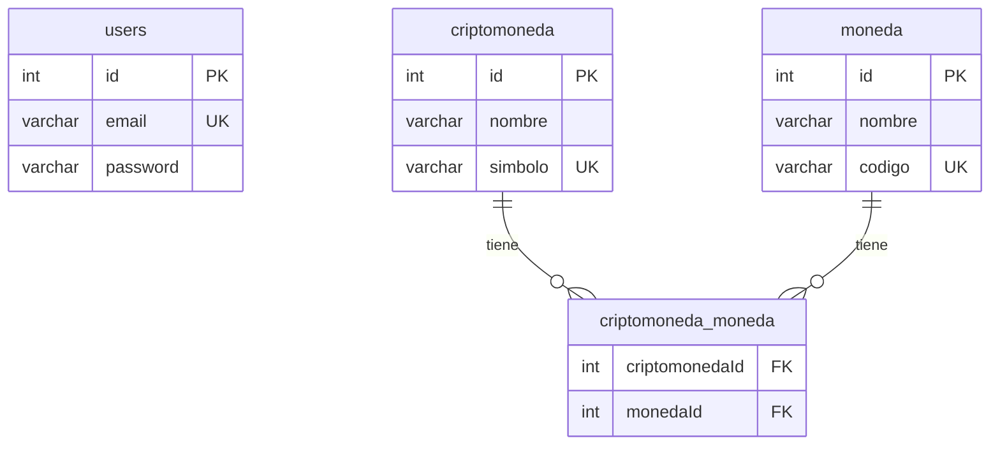

# Desafío Backend — Crypto API

API REST desarrollada con **Node.js**, **Express**, **TypeORM** y **PostgreSQL** para gestionar usuarios, monedas fiat y criptomonedas con autenticación JWT.

## Requisitos previos

- [Node.js](https://nodejs.org/) v18 o superior
- [npm](https://www.npmjs.com/)
- [Docker](https://www.docker.com/) y Docker Compose (recomendado para la base de datos)

## Instalación

### 1. Clonar el repositorio

```bash
git clone <url-del-repositorio>
cd desafio-backend
```

### 2. Instalar dependencias

```bash
npm install
```

### 3. Levantar PostgreSQL con Docker

```bash
docker compose up -d
```

Esto crea un contenedor con la siguiente configuración:

| Variable            | Valor      |
|---------------------|------------|
| Usuario             | `postgres` |
| Contraseña          | `password` |
| Base de datos       | `crypto_db`|
| Puerto              | `5433`     |

> **Nota:** se usa el puerto `5433` (en vez del 5432 por defecto) para evitar 
> conflictos si ya tenés una instancia de PostgreSQL corriendo localmente.

### 4. Configurar variables de entorno

Crea un archivo `.env` en la raíz del proyecto:

```env
PORT=3000

DB_HOST=localhost
DB_PORT=5432
DB_USER=postgres
DB_PASSWORD=password
DB_NAME=crypto_db

JWT_SECRET=tu_clave_secreta_jwt
```

> **Nota:** TypeORM está configurado con `synchronize: true`, por lo que las tablas se crean automáticamente al iniciar el servidor.

### 5. Iniciar el servidor en modo desarrollo

```bash
npm run dev
```

El servidor quedará disponible en `http://localhost:3000`.

### 6. Verificar que la API está activa

```bash
curl http://localhost:3000/health
```

Respuesta esperada:

```json
{
  "status": "ok",
  "message": "Crypto API running"
}
```

---

## Endpoints

| Método | Ruta                      | Autenticación | Descripción                          |
|--------|---------------------------|---------------|--------------------------------------|
| GET    | `/health`                 | No            | Estado del servicio                  |
| POST   | `/api/auth/register`      | No            | Registrar usuario                    |
| POST   | `/api/auth/login`         | No            | Iniciar sesión y obtener token JWT   |
| GET    | `/api/moneda`             | Sí            | Listar monedas fiat                  |
| POST   | `/api/moneda`             | Sí            | Crear moneda fiat                    |
| GET    | `/api/criptomoneda`       | Sí            | Listar criptomonedas                 |
| POST   | `/api/criptomoneda`       | Sí            | Crear criptomoneda                   |
| PUT    | `/api/criptomoneda/:id`   | Sí            | Actualizar criptomoneda              |

> Las rutas protegidas requieren el header `Authorization: Bearer <token>`.

---

## Ejemplos con cURL

> **Nota:** los ejemplos usan sintaxis estándar de `curl`, compatible con bash, Git Bash, WSL y cmd.exe. Si estás en PowerShell, usá `curl.exe` en vez de `curl` (el alias nativo de PowerShell apunta a `Invoke-WebRequest`, que maneja los flags de forma distinta), o usá `Invoke-RestMethod` como alternativa nativa.

### Autenticación

**Registrar usuario**

```bash
curl -X POST http://localhost:3000/api/auth/register -H "Content-Type: application/json" -d "{\"email\": \"usuario@ejemplo.com\", \"password\": \"123456\"}"
```

**Iniciar sesión**

```bash
curl -X POST http://localhost:3000/api/auth/login -H "Content-Type: application/json" -d "{\"email\": \"usuario@ejemplo.com\", \"password\": \"123456\"}"
```

Respuesta:

```json
{
  "token": "eyJhbGciOiJIUzI1NiIsInR5cCI6IkpXVCJ9..."
}
```

Guarda el token para las peticiones siguientes:

```bash
export TOKEN="eyJhbGciOiJIUzI1NiIsInR5cCI6IkpXVCJ9..."
```

### Monedas fiat

**Listar monedas**

```bash
curl http://localhost:3000/api/moneda -H "Authorization: Bearer $TOKEN"
```

**Crear moneda**

```bash
curl -X POST http://localhost:3000/api/moneda -H "Authorization: Bearer $TOKEN" -H "Content-Type: application/json" -d "{\"nombre\": \"Dólar estadounidense\", \"codigo\": \"USD\"}"
```

### Criptomonedas

**Listar todas las criptomonedas**

```bash
curl http://localhost:3000/api/criptomoneda -H "Authorization: Bearer $TOKEN"
```

**Filtrar por código de moneda fiat**

```bash
curl "http://localhost:3000/api/criptomoneda?moneda=USD" -H "Authorization: Bearer $TOKEN"
```

**Crear criptomoneda**

```bash
curl -X POST http://localhost:3000/api/criptomoneda -H "Authorization: Bearer $TOKEN" -H "Content-Type: application/json" -d "{\"nombre\": \"Bitcoin\", \"simbolo\": \"BTC\", \"monedaIds\": [1]}"
```

**Actualizar criptomoneda**

```bash
curl -X PUT http://localhost:3000/api/criptomoneda/1 -H "Authorization: Bearer $TOKEN" -H "Content-Type: application/json" -d "{\"nombre\": \"Bitcoin\", \"simbolo\": \"BTC\", \"monedaIds\": [1, 2]}"
```

---

## Ejemplos con Postman

1. Importa la colección creando una nueva request por cada endpoint descrito arriba.
2. Configura una variable de entorno `baseUrl` con valor `http://localhost:3000`.
3. Configura una variable `token` que se actualice tras el login.

### Flujo recomendado

| Paso | Método | URL                                      | Body (JSON)                                              |
|------|--------|------------------------------------------|----------------------------------------------------------|
| 1    | POST   | `{{baseUrl}}/api/auth/register`          | `{ "email": "usuario@ejemplo.com", "password": "123456" }` |
| 2    | POST   | `{{baseUrl}}/api/auth/login`             | `{ "email": "usuario@ejemplo.com", "password": "123456" }` |
| 3    | POST   | `{{baseUrl}}/api/moneda`                 | `{ "nombre": "Dólar estadounidense", "codigo": "USD" }`  |
| 4    | POST   | `{{baseUrl}}/api/moneda`                 | `{ "nombre": "Euro", "codigo": "EUR" }`                  |
| 5    | POST   | `{{baseUrl}}/api/criptomoneda`           | `{ "nombre": "Bitcoin", "simbolo": "BTC", "monedaIds": [1] }` |
| 6    | GET    | `{{baseUrl}}/api/criptomoneda?moneda=USD`| —                                                        |
| 7    | PUT    | `{{baseUrl}}/api/criptomoneda/1`         | `{ "nombre": "Bitcoin", "simbolo": "BTC", "monedaIds": [1, 2] }` |

### Configurar el token en Postman

En la pestaña **Authorization** de cada request protegida:

- **Type:** Bearer Token
- **Token:** `{{token}}`

O en la pestaña **Headers**:

```
Authorization: Bearer {{token}}
```

### Script automático para guardar el token (opcional)

En la request de **Login**, pestaña **Tests**:

```javascript
const response = pm.response.json();
if (response.token) {
  pm.environment.set("token", response.token);
}
```

---

## Esquema de la base de datos

### Diagrama entidad-relación



### Tablas

#### `users`

| Columna    | Tipo        | Restricciones        | Descripción              |
|------------|-------------|----------------------|--------------------------|
| `id`       | INTEGER     | PK, autoincremental  | Identificador del usuario|
| `email`    | VARCHAR     | UNIQUE, NOT NULL     | Correo electrónico       |
| `password` | VARCHAR     | NOT NULL             | Contraseña hasheada      |

#### `moneda`

| Columna  | Tipo    | Restricciones       | Descripción                    |
|----------|---------|---------------------|--------------------------------|
| `id`     | INTEGER | PK, autoincremental | Identificador de la moneda     |
| `nombre` | VARCHAR | NOT NULL            | Nombre de la moneda fiat       |
| `codigo` | VARCHAR | UNIQUE, NOT NULL    | Código ISO (ej. USD, EUR)      |

#### `criptomoneda`

| Columna   | Tipo    | Restricciones       | Descripción                      |
|-----------|---------|---------------------|----------------------------------|
| `id`      | INTEGER | PK, autoincremental | Identificador de la criptomoneda |
| `nombre`  | VARCHAR | NOT NULL            | Nombre (ej. Bitcoin)             |
| `simbolo` | VARCHAR | UNIQUE, NOT NULL    | Símbolo (ej. BTC, ETH)           |

#### `criptomoneda_moneda` (tabla intermedia)

Relación **muchos a muchos** entre criptomonedas y monedas fiat.

| Columna           | Tipo    | Restricciones | Descripción                        |
|-------------------|---------|---------------|------------------------------------|
| `criptomonedaId`  | INTEGER | FK            | Referencia a `criptomoneda.id`     |
| `monedaId`        | INTEGER | FK            | Referencia a `moneda.id`           |

---

## Estructura del proyecto

```
desafio-backend/
├── src/
│   ├── config/
│   │   └── database.ts          # Configuración de TypeORM
│   ├── entities/
│   │   ├── User.ts
│   │   ├── Moneda.ts
│   │   └── Criptomoneda.ts
│   ├── middlewares/
│   │   ├── authenticate.ts      # Validación JWT
│   │   └── validate.ts          # Validación de requests
│   ├── modules/
│   │   ├── auth/
│   │   ├── moneda/
│   │   └── criptomoneda/
│   ├── routes/
│   │   └── index.ts
│   ├── app.ts
│   └── server.ts
├── docker-compose.yml
├── package.json
└── tsconfig.json
```

## Scripts disponibles

| Comando      | Descripción                              |
|--------------|------------------------------------------|
| `npm run dev` | Inicia el servidor en modo desarrollo   |
